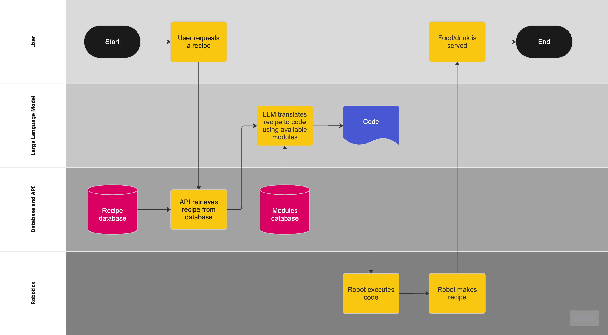

# CrossLabs Cooking Robot: Translating Natural Language to Code

In an effort to explore how large language models (LLMs) can be used to aid the planning of robots to translate natural language tasks into code for a general purpose robot, CrossLabs explores the conversion of cocktail recipes into robot-readable instructions.

## Diagram

The following is a flowchart diagramming the idea of the cooking robot. This repository specifically focuses on the LLM swimlane and the defining of the available modules in the modules database/API.

## Steps

The following are the steps that we followed to achieve the task.

1. Sample the internet for recipes (currently cocktail recipes). From each recipe, I extract action verbs such as "transfer" that I think will make good high-level abstractions.

2. Create a spreadsheet of abstract modules from the verbs sampled. For each, include paramaters that a robot would need to execute the module, as well as some example use cases.

3. Prompt engineer the Falcon 7b Instruct model to work on one line of an instruction, translating the natural language into a string of modules. At the moment, not sure how to determine how many modules it should create, so it often overshoots.

## Documentation

Here is a list of other important documentation that we have in this repository.

- [Module List](moduleList.md) - this is a list of all the modules that we plan on using
- [Architectural Decision Record](adr.md) - this file is a running record of all major decisions in the project

## Contributors

- [Oliver Wang](https://github.com/burnttomato)
- [Grant Cheng](https://github.com/CatFish47)
- Luc Caspar
- Akira Yokota
- Mahdi Khosravy
- et. al.

## Acknowledgements

Research papers, inspirations, code snippets, etc.

- [Microsoft - ChatGPT for Robotics](https://www.microsoft.com/en-us/research/group/autonomous-systems-group-robotics/articles/chatgpt-for-robotics/)
- [Falcon 7b Instruct](https://huggingface.co/tiiuae/falcon-7b-instruct)
